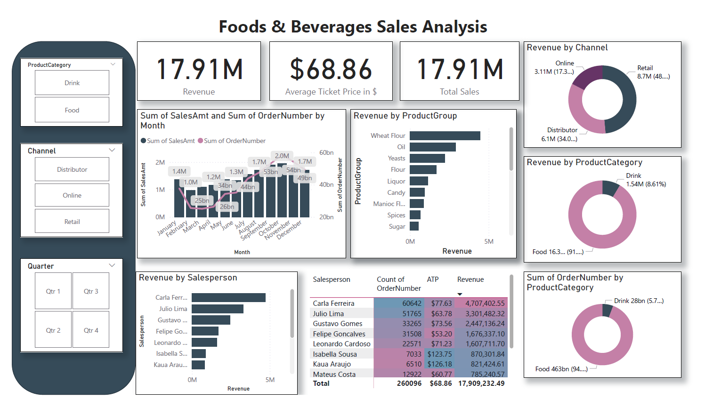

# Power BI Real World Projects

This repository is your ultimate guide to mastering Power BI through 20 real-world projects that tackle diverse, impactful challenges across industries. Whether you're a data enthusiast, Power BI beginner, or seasoned analyst, you'll find actionable insights, creative dashboard designs, and hands-on projects to elevate your Power BI skills.

## Table of Contents

- [Power BI Real World Projects](#power-bi-real-world-projects)
  - [Table of Contents](#table-of-contents)
    - [Project 2: Foods and Beverages Sales Analysis Dashboard](#project-2-foods-and-beverages-sales-analysis-dashboard)
    - [Project 3: SBudge vs. Actual Spending Analysis Dashboard](#project-3-sbudge-vs-actual-spending-analysis-dashboard)
  
### Project 2: Foods and Beverages Sales Analysis Dashboard

[Foods and Beverages Sales Analysis Dashboard](./Project2/FoodsBeveragesSalesAnalysis.pbix)

### Project 3: SBudge vs. Actual Spending Analysis Dashboard

