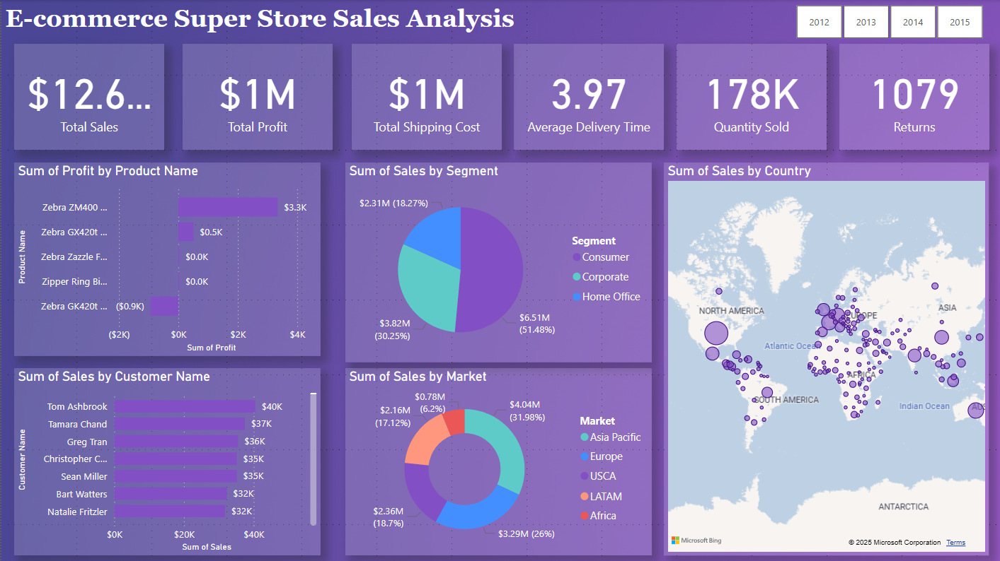

# Power BI Real World Projects

This repository is your ultimate guide to mastering Power BI through 20 real-world projects that tackle diverse, impactful challenges across industries. Whether you're a data enthusiast, Power BI beginner, or seasoned analyst, you'll find actionable insights, creative dashboard designs, and hands-on projects to elevate your Power BI skills.

## Table of Contents

- [Power BI Real World Projects](#power-bi-real-world-projects)
  - [Table of Contents](#table-of-contents)
    - [Project 2: Foods and Beverages Sales Analysis Dashboard](#project-2-foods-and-beverages-sales-analysis-dashboard)
    - [Project 3: Budge vs. Actual Spending Analysis Dashboard](#project-3-budge-vs-actual-spending-analysis-dashboard)
    - [Project 4: HR Analytics Dashboard: Attrition Analysis](#project-4-hr-analytics-dashboard-attrition-analysis)
    - [Project 5: E-commerce Super Store Sales Analysis](#project-5-e-commerce-super-store-sales-analysis)
    - [Project 7: Global Sales Data Analysis](#project-7-global-sales-data-analysis)
    - [Project 8: Boston Housing Dashboard](#project-8-boston-housing-dashboard)
    - [Project 9: Crime in Los Angeles: Yearly City Analysis](#project-9-crime-in-los-angeles-yearly-city-analysis)
    - [Project 10: IMDB Movie Comparison By Years analysis](#project-10-imdb-movie-comparison-by-years-analysis)
    - [Project 11: Hotel Reservation Dashboard: Global Hotel Business](#project-11-hotel-reservation-dashboard-global-hotel-business)
    - [Project 12: Toys Sales Analysis Dashboard](#project-12-toys-sales-analysis-dashboard)
    - [Project 13: Netflix Stock Price Dashboard](#project-13-netflix-stock-price-dashboard)
    - [Project 14: Personal Finance Management Dashboard: Financial Insights](#project-14-personal-finance-management-dashboard-financial-insights)
  
### Project 2: Foods and Beverages Sales Analysis Dashboard

[Foods and Beverages Sales Analysis Dashboard](./Project2/FoodsBeveragesSalesAnalysis.pbix)

### Project 3: Budge vs. Actual Spending Analysis Dashboard

[Budge vs. Actual Spending Analysis Dashboard](./Project3/Budget%20vs.%20Actual%20Spending%20Analysis%20Dashboard.pbix)

### Project 4: HR Analytics Dashboard: Attrition Analysis

[HR Analytics Dashboard: Attrition Analysis](./Project4/Attrition%20Analysis%20Dashboard.pbix)

### Project 5: E-commerce Super Store Sales Analysis

[E-commerce Super Store Sales Analysis](./Project5/E-commerce%20Super%20Store%20Sales%20Analysis.pbix)

### Project 7: Global Sales Data Analysis

[Global Sales Data Analysis](./Project7/GlobalSalesDataAnalysis.pbix)

### Project 8: Boston Housing Dashboard

[Boston Housing Dashboard](./Project8/BostonHousingDashboard.pbix)

### Project 9: Crime in Los Angeles: Yearly City Analysis

[Crime in Los Angeles | Yearly City Analysis](./Project9/Crime%20in%20Los%20Angles%20-%20Yearly%20City%20Analysis.pbix)

### Project 10: IMDB Movie Comparison By Years analysis

[IMDB Movie Comparison By Years](./Project10/IMDBMovieComparisonByYearsDashboard.pbix)

### Project 11: Hotel Reservation Dashboard: Global Hotel Business

[Hotel Reservation Dashboard: Global Hotel Business](./Project11/HotelReservationDashboard.pbix)

### Project 12: Toys Sales Analysis Dashboard

[Toy Sales Dashboard](./Project12/ToySalesAnalysisDashboard.pbix)

### Project 13: Netflix Stock Price Dashboard

[Netflix Stock Price Dashboard](./Project13/NetflixStockPriceDashboard.pbix)

### Project 14: Personal Finance Management Dashboard: Financial Insights

[Personal Finance Management Dashboard: Financial Insights](./Project14/PersonalFinanceManagementDashboard.pbix)
